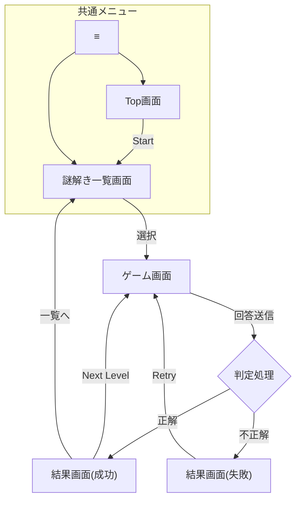

# 🕵️‍♂️ 謎解きアプリ 基本設計書

## 1. 概要
Spring Boot学習とリハビリを兼ねて開発する、Webブラウザベースの謎解きゲームアプリケーション。
「アーケードゲーム」のように手軽に遊べることを目指し、将来的には脱出ゲームのような高難易度な謎解きも提供する。

---

## 2. 機能要件 (Requirements)

### 2-1. 画面構成
| 画面名 | ステータス | 概要 |
|---|---|---|
| **Top画面** | ✅ 実装済 | アプリの入り口。各画面への遷移のみを行う。 |
| **謎解き一覧画面** | ✅ 実装済 | 挑戦したい謎を選択する。難易度やタイトルを表示。 |
| **ゲーム画面** | ✅ 実装済 | 謎解きを行うメイン画面。タイプに応じたUIを表示。 |
| **結果画面** | ✅ 実装済 | 正解・不正解を表示し、次の問題へ誘導する。 |
| 設定画面 | 🚧 未実装 | 音量設定などを想定。 |
| マイページ画面 | 🚧 未実装 | クリア状況の確認などを想定。 |
| ランキング画面 | 🚧 未実装 | クリアタイムなどを競う（Top表示も検討）。 |
| ログイン画面 | 🚧 未実装 | ユーザー認証。当面はログインなしで遊べる仕様とする。 |

### 2-2. ユーザー体験 (UX) Flow
1.  **ログイン不要:** 誰でもすぐにゲームを開始できる（アーケードスタイル）。
2.  **レベル選択:** 一覧画面から好きなレベルを選んで挑戦できる。
3.  **ゲームループ:** 「問題」→「回答」→「判定」→「結果」→「一覧/次へ」のサイクル。
4.  **中断・再開:** （※将来実装予定）途中経過をブラウザ等に保存し、再開できるようにする。

---

## 3. システム・アーキテクチャ (Architecture)

### 3-1. Layered Architecture (3層構造)
保守性を高めるため、責務を明確に分離する。

* **Controller:** `MainController`
    * 画面遷移の制御と、Serviceへの処理委譲のみを行う。
* **Service:** `RiddleService`
    * 正誤判定などのビジネスロジックを担当。
* **Repository:** `RiddleRepository`
    * データアクセスを担当。現在はJSONファイルからデータを読み込む。

### 3-2. Data Driven (データ駆動)
* 問題データ（タイトル、正解、画像パスなど）は全て外部ファイル (`riddles.json`) で管理する。
* 画面はデータに基づいて動的に生成されるため、コンテンツ追加時にコード修正が不要。

---

## 4. データ設計 (Data Model)

### 4-1. Riddle モデル
1問分のデータを表現するレコード。

| フィールド名 | 型 | 説明 |
|---|---|---|
| `id` | Integer | 問題ID (1, 2, 3...) |
| `question` | String | 問題文 |
| `answer` | String | 正解の文字列 |
| `hint` | String | ヒント |
| `level` | Integer | 難易度 (1〜5)。画面では★で表示。 |
| `type` | String | 問題の種類 (`text`, `click`, `image-map`) |
| `options` | List | クリック探索問題用のパーツリスト (Type=`click`時のみ) |
| `imageUrl` | String | 画像パス (Type=`image-map`時のみ) |

### 4-2. 問題タイプ (Quiz Types)
| タイプ | 識別子 | 仕様 |
|---|---|---|
| **テキスト入力** | `text` | テキストボックスに答えを入力して回答する標準的な形式。 |
| **クリック探索** | `click` | 文章中の特定の文字（違和感のある箇所）をクリックして回答する。 |
| **画像探索** | `image-map` | 画像内の特定のエリア（座標）をクリックして回答する。 |

---

## 5. 画面遷移図 (Screen Flow)

---

## 6. 技術スタック (Tech Stack)
- 言語: Java 21
- FW: Spring Boot 3.4.x
- ビルド: Maven
- テンプレート: Thymeleaf
- フロントエンド: HTML5, CSS3, JavaScript (Vanilla)
- テスト: JUnit 5, Mockito
- インフラ: Docker, Render

---

## ７. 開発プロセス (Development Methodology)

本プロジェクトでは、品質と保守性を担保するために **TDD (テスト駆動開発)** を採用しています。

### 7-1. TDDサイクル
新機能追加や修正は、原則として以下のサイクルで行います。

1.  **Red (失敗するテストを書く):**
    * 実装前に「あるべき振る舞い」をテストコードとして定義する。
    * 例：「画像URLを持ったRiddleオブジェクトを作成できること」など。
2.  **Green (テストを通す):**
    * テストを通過させるための最小限の実装を行う。
3.  **Refactor (コードを整理する):**
    * テストが通っている安全な状態で、変数名の改善や定数化（ハードコーディング排除）を行う。

### 7-2. テスト範囲
* **Unit Test:** Service, Model, Repository のロジック検証。
* **Web MVC Test:** Controller のルーティング、データ受け渡しの検証。

---

## 8. 今後の展望 (Roadmap / Want to do)

### 🚀 Phase 2: ゲーム性の強化
* **座標判定パズル:** 画像の特定座標範囲をクリックさせる高度な問題の実装。
* **効果音 (SE):** 正解・不正解時のサウンド追加。
* **アニメーション:** 正解時の演出強化。

### 🚀 Phase 3: ユーザー機能の拡張
* **状態保存:** ブラウザ（LocalStorage）へのクリア状況保存機能。
    * 「途中から再開」ができるようにする（現状3ゲーム分程度を想定）。
* **ランキング機能:** スコアやクリアタイムを競う機能。
    * Top画面に上位ランカーを表示。

### 🚀 Phase 4: バックエンド拡張
* **データベース接続:** JSON管理から、MySQL/PostgreSQL等のDB管理への移行。
* **管理画面:** ブラウザ上で問題を追加・編集できる管理機能の実装。