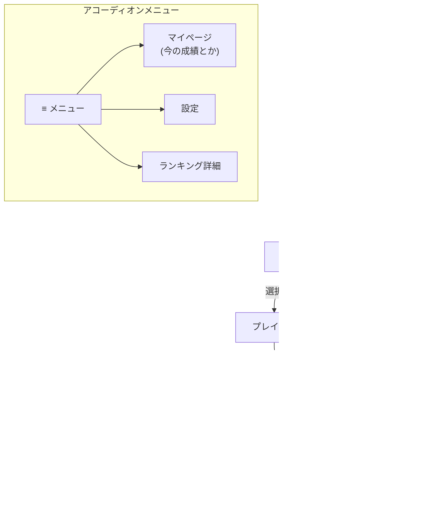

# 画面遷移図

```mermaid
graph TD
    %% メインのアクション
    Top[Top画面<br/>※ランキング上位表示] -->|挑戦！| List[謎解き一覧画面]
    List -->|選択| Game[プレイ画面]
    
    %% ゲームサイクル
    Game -->|クリア/失敗| Result[結果画面]
    Result -->|スコア登録| RankingDB[(ランキング保存)]
    Result -->|もう一回| List
    Result -->|トップへ| Top

    %% アコーディオンメニュー
    subgraph "アコーディオンメニュー"
        MenuBtn[≡ メニュー] 
        MenuBtn --> MyPage["マイページ<br/>(今の成績とか)"]
        MenuBtn --> Config[設定]
        MenuBtn --> RankAll[ランキング詳細]
    end
```
## 後々実装したい機能
- ログイン
- 途中から始める(保存、一時停止機能)